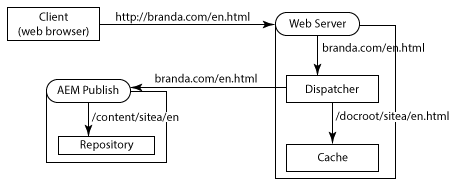
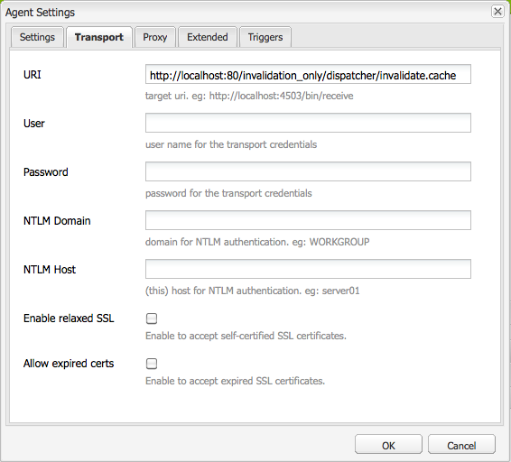
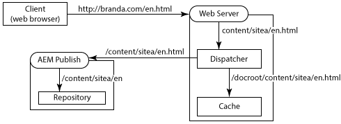
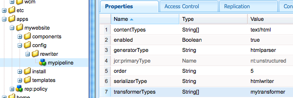

# 使用Dispatcher和多个域 {#using-dispatcher-with-multiple-domains}

>[!NOTE]
>
>Dispatcher版本独立于AEM。如果您遵循了指向嵌入AEM或CQ文档中的Dispatcher文档的链接，可能已重定向到此页面。

使用Dispatcher在多个Web域中处理页面请求，同时支持下列条件：

* 这两个域的Web内容存储在一个AEM存储库中。
* 每个域的调度程序缓存中的文件都可能单独失效。

例如，一家公司为其两个品牌publishes网站：Brand A and Brand B.网站页面的内容在AEM中创作，并存储在同一个存储库工作区中：

```
/
| - content  
   | - sitea  
       | - content nodes  
   | - siteb  
       | - content nodes
```

存储的页面 `BrandA.com` 如下所示 `/content/sitea`。对该URL的客户端请求 `https://BrandA.com/en.html` 会返回 `/content/sitea/en` 到该节点的呈现页面。同样，下面 `BrandB.com` 存储的页面也是如此 `/content/siteb`。

使用调度程序缓存内容时，必须在客户端HTTP请求中的页面URL、缓存中的相应文件的路径以及存储库中相应文件的路径之间进行关联。

## 客户端请求

客户端向Web服务器发送HTTP请求时，必须将所请求页面的URL解析为调度程序缓存中的内容，并最终解析为存储库中的内容。


1. 域名系统会发现HTTP请求中注册为域名注册的Web服务器的IP地址。
1. HTTP请求将发送到Web服务器。
1. HTTP请求被传递到Dispatcher。
1. 调度程序确定缓存的文件是否有效。如果有效，缓存的文件将提供给客户端。
1. 如果缓存的文件无效，Dispatcher将从AEM发布实例请求新渲染的页面。

## 缓存失效

当调度程序刷新复制代理请求调度程序失效缓存的文件时，存储库中内容的路径必须解析为缓存中的内容。


1. 在AEM作者实例上激活页面，内容将复制到发布实例。
1. 调度程序刷新代理调用调度程序以使重复内容的缓存失效。
1. 调度程序触摸一个或多个. stat文件以使缓存的文件失效。

要将Dispatcher与多个域一起使用，您需要配置AEM、Dispatcher和Web服务器。本页中介绍的解决方案一般适用于大多数环境。由于某些AEM拓扑的复杂性，解决方案可能需要进一步的自定义配置来解决特定问题。您可能需要调整示例以满足现有IT基础结构和管理策略。

## URL映射 {#url-mapping}

要启用域URL和内容路径以解析到缓存的文件，必须翻译文件路径或页面URL。提供以下常见策略的描述，在流程中的不同点发生路径或URL翻译：

* (推荐) AEM发布实例使用针对资源分辨率的sling映射来实现内部URL重写规则。域URL转换为内容存储库路径。(请参阅 [AEM重写传入的URL](dispatcher-domains.md#main-pars-title-2)。)
* Web服务器使用内部URL重写将域URL转换为缓存路径的内部URL规则。(请参阅 [Web服务器重写传入的URL](dispatcher-domains.md#main-pars-title-1)。)

通常需要对网页使用短URL。通常，页面URL镜像包含Web内容的存储库文件夹的结构。但是，URL不会显示最上方的存储库节点 `/content`，例如，客户端不必了解AEM存储库的结构。

## 一般要求 {#general-requirements}

您的环境必须实施以下配置以支持使用多个域的Dispatcher：

* 每个域的内容驻留在存储库的单独分支中(请参阅下面的示例环境)。
* 调度程序刷新复制代理在AEM发布实例上进行配置。(请参阅 [将调度程序缓存从Publishing实例失效](page-invalidate.md)。)
* 域名系统解析Web服务器的IP地址的域名。
* 调度程序缓存镜像AEM内容存储库的目录结构。Web服务器的文档根目录下的文件路径与存储库中文件的路径相同。

## 提供的示例环境 {#environment-for-the-provided-examples}

提供的示例解决方案适用于具有以下特点的环境：

* AEM作者和发布实例部署在Linux系统上。
* Apache HTTPD是在Linux系统上部署的Web服务器。
* AEM内容存储库和Web服务器的文档根目录使用以下文件结构(Apache Web服务器的文档根目录为/`usr/lib/apache/httpd-2.4.3/htdocs)`.

   **存储库**

```
  | - /content  
    | - sitea  
  |    | - content nodes 
    | - siteb  
       | - conent nodes
```

**Web服务器的文档根目录**

```
  | - /usr  
    | - lib  
      | - apache  
        | - httpd-2.4.3  
          | - htdocs  
            | - content  
              | - sitea  
                 | - content nodes 
              | - siteb  
                 | - content nodes
```

## AEM重写传入URL {#aem-rewrites-incoming-urls}

资源分辨率的sling映射允许您将传入的URL与AEM内容路径相关联。在AEM发布实例上创建映射，以便Dispatcher渲染请求解析为存储库中的正确内容。

调度程序页面渲染请求使用从Web服务器传递的URL识别页面。当URL包含域名时，Sling映射将解析内容的URL。以下图形说明 `branda.com/en.html` 了URL到 `/content/sitea/en` 节点的映射。



调度程序缓存镜像存储库节点结构。因此，当发生页面激活时，生成的请求无效页面请求不需要URL或路径翻译。


## 在Web服务器上定义虚拟主机 {#define-virtual-hosts-on-the-web-server}

定义Web服务器上的虚拟主机，以便将不同文档根目录分配给每个Web域：

* Web服务器必须为您的每个Web域定义一个虚拟域。
* 对于每个域，将文档根目录配置为与包含域Web内容的存储库中的文件夹一致。
* 每个虚拟域还必须包含Dispatcher相关配置，如 [安装Dispatcher](dispatcher-install.md) 页面上所述。

以下示例 `httpd.conf` 文件为Apache Web服务器配置两个虚拟域：

* 服务器名称(与域名一致)为branda.com(第16行)和brandb.com(第30行)。
* 每个虚拟域的文档根是包含站点页面的调度程序缓存中的目录。(第17行和第31行)

通过此配置，Web服务器在收到请求的请求时执行以下操作 `https://branda.com/en/products.html`：

* 将URL与 `ServerName` 具有 `branda.com.`

* 将URL转发到Dispatcher。

### httpd. conf {#httpd-conf}

```xml
# load the Dispatcher module
LoadModule dispatcher_module modules/mod_dispatcher.so
# configure the Dispatcher module
<IfModule disp_apache2.c>
 DispatcherConfig conf/dispatcher.any
 DispatcherLog    logs/dispatcher.log  
 DispatcherLogLevel 3
 DispatcherNoServerHeader 0 
 DispatcherDeclineRoot 0
 DispatcherUseProcessedURL 0
 DispatcherPassError 0
</IfModule>

# Define virtual host for brandA.com
<VirtualHost *:80>
  ServerName branda.com
  DocumentRoot /usr/lib/apache/httpd-2.4.3/htdocs/content/sitea
   <Directory /usr/lib/apache/httpd-2.4.3/htdocs/content/sitea>
     <IfModule disp_apache2.c>
       SetHandler dispatcher-handler
       ModMimeUsePathInfo On
     </IfModule>
     Options FollowSymLinks
     AllowOverride None
   </Directory>
</VirtualHost>

# define virtual host for brandB.com
<VirtualHost *:80>
  ServerName brandB.com
  DocumentRoot /usr/lib/apache/httpd-2.4.3/htdocs/content/siteb
   <Directory /usr/lib/apache/httpd-2.4.3/htdocs/content/siteb>
     <IfModule disp_apache2.c>
       SetHandler dispatcher-handler
       ModMimeUsePathInfo On
     </IfModule>
     Options FollowSymLinks
     AllowOverride None
   </Directory>
</VirtualHost>

# document root for web server
DocumentRoot "/usr/lib/apache/httpd-2.4.3/htdocs"
```

请注意，虚拟主机继承在主服务器部分中配置 [的调度程序配置](dispatcher-install.md#main-pars-67-table-7) 属性值。虚拟主机可以包括自己的dispatcherConfig属性以覆盖主服务器配置。

### 配置Dispatcher以处理多个域 {#configure-dispatcher-to-handle-multiple-domains}

要支持包含域名及其相应虚拟主机的URL，请定义以下Dispatcher农场：

* 为每个虚拟主机配置一个调度程序农场。这些农场处理来自每个域的Web服务器请求、检查缓存的文件并请求来自渲染的页面。
* 配置用于使缓存无效的调度程序农场，无论内容属于哪个域。此农场处理来自刷新Dispatcher复制代理的文件失效请求。

### 为虚拟主持人创建调度程序农场

虚拟主机的农场必须具有以下配置，以便在调度程序缓存中将客户端HTTP请求中的URL解析为正确的文件：

* `/virtualhosts` 属性设置为域名。此属性允许Dispatcher将农场与域关联。
* `/filter` 该属性允许访问在域名部分之后截断的请求URL路径。例如，对于 `https://branda.com/en.html` URL，路径解释为 `/en.html`，因此过滤器必须允许访问此路径。

* `/docroot` 属性设置为调度程序缓存中域站点内容根目录的路径。此路径用作最初请求的连接URL的前缀。例如， `/usr/lib/apache/httpd-2.4.3/htdocs/sitea` 请求的docroot将解析 `https://branda.com/en.html` 到 `/usr/lib/apache/httpd-2.4.3/htdocs/sitea/en.html` 文件。

此外，必须将AEM发布实例指定为虚拟主机的渲染。根据需要配置其他农场属性。以下代码是branda.com域的简单农场配置：

```xml
/farm_sitea  {     
    ...
    /virtualhosts { "branda.com" }
    /renders {
      /rend01  { /hostname "127.0.0.1"  /port "4503" }
    }
    /filter {
      /0001 { /type "deny"  /glob "*" }
      /0023 { /type "allow" /glob "*/en*" }  
      ...
     }
    /cache {
      /docroot "/usr/lib/apache/httpd-2.4.3/htdocs/content/sitea"
      ...
   }
   ...
}
```

### 为缓存失效创建调度程序农场

需要调度程序农场来处理缓存的文件的无效请求。此农场必须能够访问每个虚拟主机的docroot目录中的. stat文件。

以下属性配置允许Dispatcher从缓存中的文件解析AEM内容存储库中的文件：

* `/docroot` 该属性设置为Web服务器的默认docroot。通常，这是创建 `/content` 文件夹的目录。Linux上Apache的示例值 `/usr/lib/apache/httpd-2.4.3/htdocs`为。
* `/filter` 该属性允许访问 `/content` 目录下的文件。

`/statfileslevel`该属性必须足够高，以便在每个虚拟主机的根目录中创建. stat文件。此属性允许每个域的缓存单独失效。对于示例设置， `/statfileslevel``2` 创建 `*docroot*/content/sitea` 目录和 `*docroot*/content/siteb` 目录中的create. stat文件值。

此外，必须将发布实例指定为虚拟主机的渲染。根据需要配置其他农场属性。以下代码是用于使缓存失效的农场的缩写配置：

```xml
/farm_flush {  
    ...
    /virtualhosts   { "invalidation_only" }
    /renders  {
      /rend01  { /hostname "127.0.0.1" /port "4503" }
    }
    /filter   {
      /0001 { /type "deny"  /glob "*" }
      /0023 { /type "allow" /glob "*/content*" } 
      ...
      }
    /cache  {
       /docroot "/usr/lib/apache/httpd-2.4.3/htdocs"
       /statfileslevel "2"
       ...
   }
   ...
}
```

启动Web服务器时，调度程序日志(调试模式下)指示所有农场的初始化：

```shell
Dispatcher initializing (build 4.1.2)
[Fri Nov 02 16:27:18 2012] [D] [24974(140006182991616)] farms[farm_sitea].cache.docroot = /usr/lib/apache/httpd-2.4.3/htdocs/content/sitea
[Fri Nov 02 16:27:18 2012] [D] [24974(140006182991616)] farms[farm_siteb].cache.docroot = /usr/lib/apache/httpd-2.4.3/htdocs/content/siteb
[Fri Nov 02 16:27:18 2012] [D] [24974(140006182991616)] farms[farm_flush].cache.docroot = /usr/lib/apache/httpd-2.4.3/htdocs
[Fri Nov 02 16:27:18 2012] [I] [24974(140006182991616)] Dispatcher initialized (build 4.1.2)
```

### 为资源分辨率配置切片映射 {#configure-sling-mapping-for-resource-resolution}

将Sling映射用于资源分辨率，以便基于域的URL解析到AEM发布实例上的内容。资源映射将传入的URL从调度程序(最初从客户端HTTP请求)转换为内容节点。

要了解Sling资源映射，请参阅 [Sling文档中的“资源分辨率](https://sling.apache.org/site/mappings-for-resource-resolution.html) 映射”。

通常，映射是以下资源必需的，但可能需要额外的映射：

* 内容页面的根节点(以下 `/content`)
* 页面使用的设计节点(以下 `/etc/designs`)
* The `/libs` folder

创建内容页面映射后，要发现其他必需映射，请使用Web浏览器打开Web服务器上的页面。在发布实例的error. log文件中，找到有关未找到的资源的消息。下面的示例消息表示需要 `/etc/clientlibs` 映射：

```shell
01.11.2012 15:59:24.601 *INFO* [10.36.34.243 [1351799964599] GET /etc/clientlibs/foundation/jquery.js HTTP/1.1] org.apache.sling.engine.impl.SlingRequestProcessorImpl service: Resource /content/sitea/etc/clientlibs/foundation/jquery.js not found
```

>[!NOTE]
>
>默认Apache Sling重写器的链接检查器转换器可自动修改页面中的超链接以防止断开链接。但是，只有当链接目标为HTML或HTM文件时，才会执行链接重写。要更新指向其他文件类型的链接，请创建一个转换器组件并将其添加到HTML重写程序管道。

### 资源映射节点示例

下表列出了实现branda.com域资源映射的节点。将为 `brandb.com` 该域创建类似节点， `/etc/map/http/brandb.com`如。在所有情况下，当页面HTML中的引用在Sling上下文中无法正确解析时，需要映射。

| 节点路径 | 类型 | 属性 |
|--- |--- |--- |
| `/etc/map/http/branda.com` | sling：映射 | 名称：sling：内部直接类型：字符串值：/content/sitea |
| `/etc/map/http/branda.com/libs` | sling：映射 | 名称：sling：内部直接 <br/>类型：字符串 <br/>值：/libs |
| `/etc/map/http/branda.com/etc` | sling：映射 |
| `/etc/map/http/branda.com/etc/designs` | sling：映射 | 名称：sling：InternalRedirect <br/>VType：字符串 <br/>VValue：/etc/designs |
| `/etc/map/http/branda.com/etc/clientlibs` | sling：映射 | 名称：sling：InternalRedirect <br/>VType：字符串 <br/>VValue：/etc/clientlibs |

## 配置调度程序刷新复制代理 {#configuring-the-dispatcher-flush-replication-agent}

AEM发布实例上的调度程序刷新复制代理必须向正确的Dispatcher农场发送失效请求。要定位农场，请使用调度程序刷新复制代理的URI属性(在传输选项卡上)。将配置为使缓存失效的调度程序农场 `/virtualhost` 的属性值：

`https://*webserver_name*:*port*/*virtual_host*/dispatcher/invalidate.cache`

例如，要使用上一示例 `farm_flush` 的农场，URI就 `https://localhost:80/invalidation_only/dispatcher/invalidate.cache`是。



## Web服务器重写传入URL {#the-web-server-rewrites-incoming-urls}

使用Web服务器的内部URL重写功能将基于域的URL翻译为调度程序缓存中的文件路径。例如， `https://brandA.com/en.html` 对页面的客户端请求会翻译为Web服务器的文档根中的 `content/sitea/en.html`文件。



调度程序缓存镜像存储库节点结构。因此，当发生页面激活时，生成的请求使缓存页面失效的请求不需要URL或路径翻译。


## 在Web服务器上定义虚拟主机和重写规则 {#define-virtual-hosts-and-rewrite-rules-on-the-web-server}

在Web服务器上配置以下几个方面：

* 为每个Web域定义虚拟主机。
* 对于每个域，将文档根目录配置为与包含域Web内容的存储库中的文件夹一致。
* 对于每个虚拟域，创建一个URL重命名规则，该规则将传入的URL转换为缓存文件的路径。
* 每个虚拟域还必须包含Dispatcher相关配置，如 [安装Dispatcher](dispatcher-install.md) 页面上所述。
* Dispatcher模块必须配置为使用Web服务器已重写的URL。(请参阅 `DispatcherUseProcessedURL` 安装Dispatcher中 [的属性](dispatcher-install.md)。)

以下示例httpd. conf文件为Apache Web服务器配置两个虚拟主机：

* 服务器名称(与域名一致)为 `brandA.com` (第16行)和 `brandB.com` (第32行)。

* 每个虚拟域的文档根是包含站点页面的调度程序缓存中的目录。(第20行和第33行)
* 每个虚拟域的URL重写规则是一个正则表达式，它使用缓存中页面的路径前缀请求页面的路径。(第19行和35行)
* `DispatherUseProcessedURL` 属性 `1`设置为。(第10行)

例如，Web服务器在收到带有 `https://brandA.com/en/products.html` URL的请求时执行以下操作：

* 将URL与 `ServerName` 具有 `brandA.com.`
* 将URL重写为 `/content/sitea/en/products.html.`
* 将URL转发到Dispatcher。

### httpd. conf {#httpd-conf-1}

```xml
# load the Dispatcher module
LoadModule dispatcher_module modules/mod_dispatcher.so
# configure the Dispatcher module
<IfModule disp_apache2.c>
 DispatcherConfig conf/dispatcher.any
 DispatcherLog    logs/dispatcher.log  
 DispatcherLogLevel 3
 DispatcherNoServerHeader 0 
 DispatcherDeclineRoot 0
 DispatcherUseProcessedURL 1
 DispatcherPassError 0
</IfModule>

# Define virtual host for brandA.com
<VirtualHost *:80>
  ServerName branda.com
  DocumentRoot /usr/lib/apache/httpd-2.4.3/htdocs/content/sitea
  RewriteEngine  on
  RewriteRule    ^/(.*)\.html$  /content/sitea/$1.html [PT]
   <Directory /usr/lib/apache/httpd-2.4.3/htdocs/content/sitea>
     <IfModule disp_apache2.c>
       SetHandler dispatcher-handler
       ModMimeUsePathInfo On
     </IfModule>
     Options FollowSymLinks
     AllowOverride None
   </Directory>
</VirtualHost>

# define virtual host for brandB.com
<VirtualHost *:80>
  ServerName brandB.com
  DocumentRoot /usr/lib/apache/httpd-2.4.3/htdocs/content/siteb
  RewriteEngine  on
  RewriteRule    ^/(.*)\.html$  /content/siteb/$1.html [PT]
   <Directory /usr/lib/apache/httpd-2.4.3/htdocs/content/siteb>
     <IfModule disp_apache2.c>
       SetHandler dispatcher-handler
       ModMimeUsePathInfo On
     </IfModule>
     Options FollowSymLinks
     AllowOverride None
   </Directory>
</VirtualHost>

# document root for web server
DocumentRoot "/usr/lib/apache/httpd-2.4.3/htdocs"
```

### 配置调度程序农场 {#configure-a-dispatcher-farm}

Web服务器重写URL时，调度程序需要一个根据 [配置Dispatcher定义的单一农场](dispatcher-configuration.md)。需要以下配置才能支持Web服务器虚拟主机和URL重命名规则：

* `/virtualhosts` 该属性必须包含所有VirtalHost定义的serverName值。
* `/statfileslevel` 该属性必须足够高，才能在目录中创建包含每个域内容文件的. stat文件。

以下示例配置文件基于随Dispatcher一起安装的示例 `dispatcher.any` 文件。需要以下更改才能支持上 `httpd.conf` 一文件的Web服务器配置：

* `/virtualhosts` 此属性会导致调度程序处理对和 `brandA.com``brandB.com` 域的请求。(第12行)
* `/statfileslevel` 属性设置为2，以便在包含域Web内容的每个目录中创建stat文件(第41行)： `/statfileslevel "2"`

像平常一样，缓存的文档根与Web服务器的文档根(第40行)相同： `/usr/lib/apache/httpd-2.4.3/htdocs`

### `dispatcher.any` {#dispatcher-any}

```xml
/name "testDispatcher"
/farms
  {
  /dispfarm0
    {  
    /clientheaders
      {
      "*"
      }      
    /virtualhosts
      {
      "brandA.com" "brandB.com"
      }
    /renders
      {
      /rend01    {  /hostname "127.0.0.1"   /port "4503"  }
      }
    /filter
      {
      /0001 { /type "deny"  /glob "*" }
      /0023 { /type "allow" /glob "*/content*" }  # disable this rule to allow mapped content only
      /0041 { /type "allow" /glob "* *.css *"   }  # enable css
      /0042 { /type "allow" /glob "* *.gif *"   }  # enable gifs
      /0043 { /type "allow" /glob "* *.ico *"   }  # enable icos
      /0044 { /type "allow" /glob "* *.js *"    }  # enable javascript
      /0045 { /type "allow" /glob "* *.png *"   }  # enable png
      /0046 { /type "allow" /glob "* *.swf *"   }  # enable flash
      /0061 { /type "allow" /glob "POST /content/[.]*.form.html" }  # allow POSTs to form selectors under content
      /0062 { /type "allow" /glob "* /libs/cq/personalization/*"  }  # enable personalization
      /0081 { /type "deny"  /glob "GET *.infinity.json*" }
      /0082 { /type "deny"  /glob "GET *.tidy.json*"     }
      /0083 { /type "deny"  /glob "GET *.sysview.xml*"   }
      /0084 { /type "deny"  /glob "GET *.docview.json*"  }
      /0085 { /type "deny"  /glob "GET *.docview.xml*"  }      
      /0086 { /type "deny"  /glob "GET *.*[0-9].json*" }
      /0090 { /type "deny"  /glob "* *.query.json*" }
      }
    /cache
      {
      /docroot "/usr/lib/apache/httpd-2.4.3/htdocs"
      /statfileslevel "2"
      /allowAuthorized "0"
      /rules
        {
        /0000  { /glob "*"     /type "allow"  }
        }
      /invalidate
        {
        /0000  {   /glob "*" /type "deny"  }
        /0001 {  /glob "*.html" /type "allow"  }
        }
      /allowedClients
        {
        }     
      }
    /statistics
      {
      /categories
        {
        /html  { /glob "*.html" }
        /others  {  /glob "*"  }
        }
      }
    }
  }
```

>[!NOTE]
>
>由于定义了单个调度程序农场，因此AEM发布实例上的调度程序刷新复制代理不需要特殊配置。

## 重写指向非HTML文件的链接 {#rewriting-links-to-non-html-files}

要重写对.html或.htm以外的扩展的引用，请创建一个Sling Rewriter转换器组件，并将其添加到默认的重写程序管线。

当资源路径在Web服务器上下文中无法正确解析时重写引用。例如，当图像生成组件创建/content/sitea/en/products.navimage.png等链接时，需要转换器。[“如何创建完全特色Internet网站”的topnav组件](https://helpx.adobe.com/experience-manager/6-3/sites/developing/using/the-basics.html) 创建了此类链接。

[Sling Rewriter](https://sling.apache.org/documentation/bundles/output-rewriting-pipelines-org-apache-sling-rewriter.html) 是一个用于处理Sling输出的模块。重写器的SAX管道实现由一个生成器、一个或多个转换器以及一个序列化器组成：

* **Generator：** 解析sling输出流(HTML文档)，并在遇到特定元素类型时生成SAX事件。
* **转换器：** 监听SAX事件，然后修改事件目标(HTML元素)。作者管道包含零个或更多个转换器。转换器按顺序执行，将SAX事件传递到序列中的下一个变压器。
* **Serializer：** 序列化输出，包括每个转换器的修改。


### AEM Default Rewriter管道 {#the-aem-default-rewriter-pipeline}

AEM使用默认的管道重写程序处理文本/html类型的文档：

* 生成器在遇到一个、img、面积、表单、基础、链接、脚本和正文元素时解析HTML文档并生成SAX事件。生成器别名 `htmlparser`。
* 该管道包括以下转换程序： `linkchecker``mobile`、 `mobiledebug``contentsync`.`linkchecker` 转换器将路径导出到引用的HTML或HTM文件以防止断开链接。
* 序列化器将写入HTML输出。序列化器别名为html作者。

`/libs/cq/config/rewriter/default` 节点定义管道。

### 创建转换器 {#creating-a-transformer}

执行以下任务以创建转换器组件并在管道中使用它：

1. 实现 `org.apache.sling.rewriter.TransformerFactory` 界面。此类创建您的变压器类的实例。指定 `transformer.type` 属性(转换器别名)的值，并将类配置为OSGi服务组件。
1. 实现 `org.apache.sling.rewriter.Transformer` 界面。要使工作最小化，您可以扩展 `org.apache.cocoon.xml.sax.AbstractSAXPipe` 类。重写StartElement方法以自定义重写行为。对于传递到变压器的每个SAX事件调用此方法。
1. 捆绑和部署类。
1. 向AEM应用程序添加配置节点，以将变压器添加到管道。

>[!TIP]
>您可以改为将TransformerFactory配置为将转换器插入到定义的每个重写器中。因此，您无需配置管道：
>
>* 将 `pipeline.mode` 属性设置 `global`为。
>* 将 `service.ranking` 该属性设置为正整数。
>* 请勿包含 `pipeline.type` 属性。


>[!NOTE]
>
>使用Content Package Maven插件的 [多模块](https://helpx.adobe.com/experience-manager/aem-previous-versions.html) 标题创建您的Maven项目。PMI自动创建和安装内容包。

以下示例实现了一个可重写对图像文件引用的转换器。

* MyRewRitterTransformerFactory类实例化MyRewRitterTransformer对象。preview. type属性将变压器别名设置为myptransformer。要在管道中包含别名，管道配置节点在转换器列表中包括此别名。
* MyRewRitterTransformer类覆盖AbstractSaveTransformer类的startElement方法。startElement方法重写img元素src属性的值。

这些示例不健壮，不应在生产环境中使用。

### 示例TransformerFactory实现 {#example-transformerfactory-implementation}

```java
package com.adobe.example;

import org.apache.felix.scr.annotations.Component;
import org.apache.felix.scr.annotations.Service;
import org.apache.felix.scr.annotations.Property;

import org.apache.sling.rewriter.Transformer;
import org.apache.sling.rewriter.TransformerFactory;

@Component
@Service
public class MyRewriterTransformerFactory implements TransformerFactory {
    /* Define the alias */
    @Property(value="mytransformer")
    static final String PIPELINE_TYPE ="pipeline.type";
 
    public Transformer createTransformer() {
        
        return new MyRewriterTransformer ();
    }
}
```

### Transformer Implementation示例 {#example-transformer-implementation}

```java
package com.adobe.example;

import java.io.IOException;

import org.apache.cocoon.xml.sax.AbstractSAXPipe;

import org.apache.sling.api.SlingHttpServletRequest;
import org.apache.sling.rewriter.ProcessingComponentConfiguration;
import org.apache.sling.rewriter.ProcessingContext;
import org.apache.sling.rewriter.Transformer;

import org.slf4j.Logger;
import org.slf4j.LoggerFactory;

import org.xml.sax.Attributes;
import org.xml.sax.SAXException;
import org.xml.sax.helpers.AttributesImpl;

import javax.servlet.http.HttpServletRequest;

public class MyRewriterTransformer extends AbstractSAXPipe implements Transformer {

 private static final Logger log = LoggerFactory.getLogger(MyRewriterTransformer.class);
 private SlingHttpServletRequest httpRequest; 
 /* The element and attribute to act on  */
 private static final String ATT_NAME = new String("src");
 private static final String EL_NAME = new String("img");

 public MyRewriterTransformer () {
 }
 public void dispose() {
 }
 public void init(ProcessingContext context, ProcessingComponentConfiguration config) throws IOException {
  this.httpRequest = context.getRequest();
  log.debug("Transforming request {}.", httpRequest.getRequestURI());
 }
 @Override
 public void startElement (String nsUri, String localname, String qname, Attributes atts) throws SAXException {
  /* copy the element attributes */
  AttributesImpl linkAtts = new AttributesImpl(atts); 
  /* Only interested in EL_NAME elements */
  if(EL_NAME.equalsIgnoreCase(localname)){

   /* iterate through the attributes of the element and act only on ATT_NAME attributes */
   for (int i=0; i < linkAtts.getLength(); i++) {
    if (ATT_NAME.equalsIgnoreCase(linkAtts.getLocalName(i))) {
     String path_in_link = linkAtts.getValue(i);

     /* use the resource resolver of the http request to reverse-resolve the path  */
     String mappedPath = httpRequest.getResourceResolver().map(httpRequest, path_in_link);

     log.info("Tranformed {} to {}.", path_in_link,mappedPath);

     /* update the attribute value */
     linkAtts.setValue(i,mappedPath);
    }
   }

  }
        /* return updated attributes to super and continue with the transformer chain */
 super.startElement(nsUri, localname, qname, linkAtts);
 }
}
```

### 将Transformer添加到Redewriter管道 {#adding-the-transformer-to-a-rewriter-pipeline}

创建一个JCR节点，它定义使用您的变压器的管道。以下节点定义创建一个处理文本/html文件的管道。使用默认AEM生成器和HTML分析器。

>[!NOTE]
>
>如果将Transformer属性 `pipeline.mode` 设置为， `global`则无需配置管道。`global` 此模式将变压器插入到所有管道中。

### 重写配置节点- XML表示法 {#rewriter-configuration-node-xml-representation}

```xml
<?xml version="1.0" encoding="UTF-8"?>
<jcr:root xmlns:jcr="https://www.jcp.org/jcr/1.0" xmlns:nt="https://www.jcp.org/jcr/nt/1.0"
    jcr:primaryType="nt:unstructured"
    contentTypes="[text/html]"
    enabled="{Boolean}true"
    generatorType="htmlparser"
    order="5"
    serializerType="htmlwriter"
    transformerTypes="[mytransformer]">
</jcr:root>
```

下图显示了节点的CRXDE Lite表示形式：


