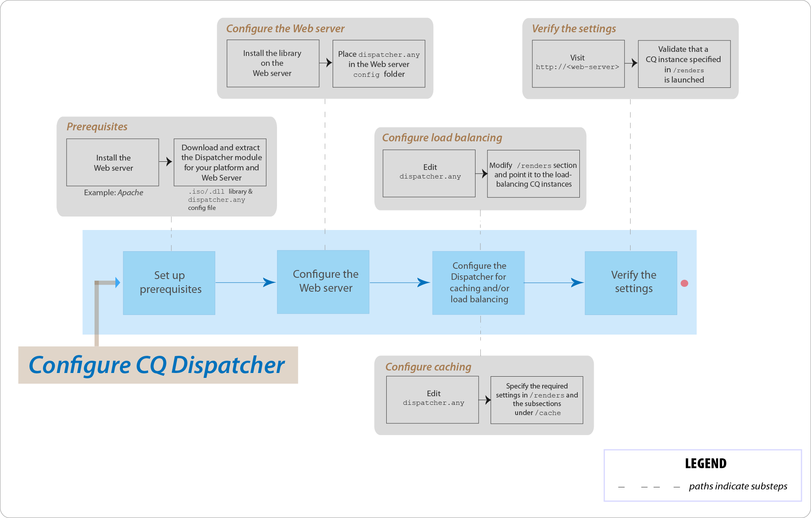

# AEM调度程序热点问题常见问题解答



## 简介

### 什么是Dispatcher？

Dispatcher是Adobe Experience Manager的缓存和/或负载平衡工具，可帮助实现快速、动态的Web创作环境。对于缓存，Dispatcher作为HTTP服务器的一部分工作，如Apache，目的是尽可能多地存储(或“缓存”)尽可能多的静态网站内容，并尽可能少地访问网站的布局引擎。在负载平衡角色中，Dispatcher分布跨不同AEM实例(渲染)的用户请求(加载)。

对于缓存，Dispatcher模块使用Web服务器提供静态内容的能力。Dispatcher将缓存的文档放入Web服务器的文档根中。

### Dispatcher如何执行缓存？

Dispatcher使用Web服务器提供静态内容的能力。Dispatcher将缓存的文档存储在Web服务器的文档根目录中。Dispatcher有两种主要方法，用于在网站进行更改时更新缓存内容。

* **“内容更新** ”删除了已更改的页面以及与它们直接关联的文件。
* **自动失效会** 自动使缓存的那些部分失效，这些部分可能在更新后过期。例如，它有效地将相关页面标记为过时，而不删除任何内容。

### 负载平衡有哪些好处？

负载平衡在多个AEM实例中分发用户请求(加载)。下面列出了负载平衡的优势：

* **提高处理能力**：实际上，这意味着Dispatcher在AEM的多个实例之间共享文档请求。由于每个实例都有更少的文档处理时间，因此响应时间更短。Dispatcher保留每个文档类别的内部统计数据，因此它可以有效地估计加载和分发查询。
* **更高的故障排除范围**：如果Dispatcher没有接收来自实例的响应，它会自动将请求发送到其他实例之一。因此，如果某个实例变得不可用，则唯一的效果就是该站点的速度下降，这与损失的计算能力成正比。

>[!NOTE]
>
>有关详细信息，请参阅 [调度程序概述页面](dispatcher.md)

## 安装和配置

### 从何处下载Dispatcher模块？

您可以从 [Dispatcher发行说明](release-notes.md) 页面下载最新的Dispatcher模块。

### 如何安装Dispatcher模块？

请参阅 [安装Dispatcher](dispatcher-install.md) 页面

### 如何配置调度程序模块？

请参阅 [配置Dispatcher](dispatcher-configuration.md) 页面。

### 如何为作者实例配置Dispatcher？

有关详细步骤，请参阅 [将Dispatcher与作者实例](dispatcher.md#using-a-dispatcher-with-an-author-server) 一起使用。

### 如何配置包含多个域的调度程序？

您可以配置包含多个域的CQ调度程序，前提是域满足以下条件：

* 两个域的Web内容存储在一个AEM存储库中
* 每个域中的调度程序缓存中的文件可能会单独失效

有关更多详细信息，请参阅 [使用Dispatcher与多个域](dispatcher-domains.md) 。

### 如何配置Dispatcher，以便用户的所有请求路由到同一个Publish实例？

您可以使用 [黏性连接](dispatcher-configuration.md#identifying-a-sticky-connection-folder-stickyconnectionsfor) 功能，这可以确保在AEM的同一实例上处理用户的所有文档。如果您使用个性化的页面和会话数据，此功能很重要。数据存储在实例中。因此，来自同一用户的后续请求必须返回到该实例，否则数据会丢失。

因为粘性连接限制了Dispatcher优化请求的能力，因此仅在必要时才应使用此方法。您可以指定包含“粘性”文档的文件夹，从而确保在同一个实例上处理该文件夹中的所有文档。

### 我是否可以使用粘性连接并同时缓存？

对于大多数使用粘性连接的页面，您应关闭缓存。否则，将向所有用户显示该页面的同一实例，而不考虑会话内容。

对于某些应用程序，可以同时使用粘性连接和缓存。例如，如果您显示一个将数据写入会话的表单，则可以使用粘性连接并同时缓存。

### Dispatcher和AEM Publish实例是否可以驻留在同一台物理计算机上？

是，如果计算机足够强大。但是，建议您在不同计算机上设置Dispatcher和AEM Publish实例。

通常，Publish实例驻留在防火墙内，Dispatcher驻留在DMZ中。如果您决定在同一物理计算机上同时具有发布实例和调度程序，请确保防火墙设置禁止从外部网络直接访问发布实例。

### 我是否可以只缓存具有特定扩展的文件？

是. 例如，如果您只想缓存GIF文件，请在调度程序的缓存部分指定*. gif。

### 如何从缓存删除文件？

您可以使用HTTP请求从缓存中删除文件。收到HTTP请求后，调度程序将从缓存中删除文件。仅当调度程序收到页面请求时，调度程序才会再次缓存这些文件。以此方式删除缓存的文件适用于不可能同时收到同一页面请求的网站。

HTTP请求的语法如下：

```
POST /dispatcher/invalidate.cache HTTP/1.1
CQ-Action: Activate
CQ-Handle: path-pattern
Content-Length: 0
```

调度程序删除缓存的文件和文件夹，这些文件和文件夹的名称与CQ-Handle头的值匹配。例如，CQ句柄 `/content/geomtrixx-outdoors/en` 匹配以下项目：

geometrixx-outdoors目录中命名为en的所有文件(在geometrixx-outdoors目录中命名 `_jcr_content` )在en目录下命名的所有目录(如果该目录存在，该目录包含页面的子节点的缓存呈现)仅当 `CQ-Action` is `Delete` 或 `Deactivate`.

有关此主题的详细信息，请参阅 [手动使调度程序缓存失效](page-invalidate.md)。

### 如何实施权限敏感型缓存？

请参阅 [缓存安全内容](permissions-cache.md) 页面。

### 如何保护调度程序和CQ实例之间的通信？

请参阅 [Dispatcher安全核对清单](security-checklist.md) 和 [AEM安全核对清单](https://helpx.adobe.com/experience-manager/6-4/sites/administering/using/security-checklist.html) 页面。

### 调度程序问题 `jcr:content` 已更改为 `jcr%3acontent`

**问题**：我们最近在调度程序级别遇到一个问题，该问题导致某个ajax调用中有一个数据表单CQ存储库包含 `jcr:content` 它，而该调用被编码为 `jcr%3acontent` 导致结果集错误。

**答案**：请使用 `ResourceResolver.map()` 方法获取使用/发布请求的“友好”URL，以及解决Dispatcher的缓存问题。map()方法将 `:` 冒号编码为下划线，resolve()方法将它们解码回SLING JCR可读格式。您需要使用map()方法生成在Ajax调用中使用的URL。

进一步阅读： [https://sling.apache.org/documentation/the-sling-engine/mappings-for-resource-resolution.html#namespace-mangling](https://sling.apache.org/documentation/the-sling-engine/mappings-for-resource-resolution.html#namespace-mangling)

## 刷新调度程序

### 如何配置Dispatcher在Publish实例上的刷新代理？

请参阅 [复制](https://helpx.adobe.com/content/help/en/experience-manager/6-4/sites/deploying/using/replication.html#ConfiguringyourReplicationAgents) 页面。

### 如何排除调度程序刷新问题？

[请参阅此排除问题](https://helpx.adobe.com/content/help/en/experience-manager/kb/troubleshooting-dispatcher-flushing-issues.html) 的疑难解答文章：

* 如何调试在调度程序缓存中没有保存内容的情况？
* 如何调试缓存文件未更新的情况？
* 我如何调试与Dispatcher刷新相关的情况？

如果删除操作导致Dispatcher刷新， [请使用Sensei Martin撰写的此社区博客文章中的解决办法](https://mkalugin-cq.blogspot.in/2012/04/i-have-been-working-on-following.html)。

### 如何从调度程序缓存刷新DAM资产？

您可以使用“链复制”功能。启用此功能后，调度程序刷新代理将在从作者收到复制时发送刷新请求。

要启用它，请执行以下操作：

1. [按照以下](page-invalidate.md#invalidating-dispatcher-cache-from-a-publishing-instance) 步骤在发布上创建刷新代理
1. 转到每个代理的配置，在 **触发器** 选项卡上选中“接收接收 **** ”框。

## 杂项

Dispatcher如何确定文档是否处于最新状态？
要确定文档是最新的，Dispatcher执行下列操作：

它检查文档是否要自动失效。如果没有，则将文档视为最新。
如果将文档配置为自动失效，Dispatcher将检查它是否比上次可用的更改旧或更新。如果旧版本，Dispatcher将从AEM实例请求当前版本，并替换缓存中的版本。

### 调度程序如何返回文档？

您可以使用 [Dispatcher配置](dispatcher-configuration.md) 文件定义调度程序是否缓存文档 `dispatcher.any`。Dispatcher会根据可缓存文档列表检查请求。如果文档不在此列表中，Dispatcher将从AEM实例请求文档。

`/rules` 该属性控制根据文档路径缓存哪些文档。无论 `/rules` 属性如何，调度程序在下列情况下都不会缓存文档：

* 如果请求URI包含问号 `(?)`。
* 这通常表示动态页面，如不需要缓存的搜索结果。
* 缺少文件扩展名。
* Web服务器需要该扩展来确定文档类型(MIME类型)。
* 设置了身份验证头(可以配置此功能)
* 如果AEM实例响应以下标题：
   * no-cache
   * 无商店
   * 必须重新验证

Dispatcher将缓存的文件存储在Web服务器上，就像它们是静态网站的一部分一样。如果用户请求缓存的文档，Dispatcher会检查该文档是否存在于Web服务器的文件系统中。如果是，Dispatcher将返回文档。如果没有，Dispatcher将从AEM实例请求文档。

>[!NOTE]
>
>GET或HEAD(对于HTTP头)方法由Dispatcher进行缓存。有关响应头缓存的其他信息，请参阅 [“缓存HTTP响应头](dispatcher-configuration.md#caching-http-response-headers) ”部分。

### 我是否可以在设置中实施多个调度程序？

是. 在这种情况下，请确保调度程序都可以直接访问AEM网站。Dispatcher无法处理来自其他Dispatcher的请求。

