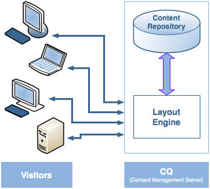
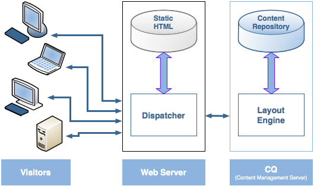
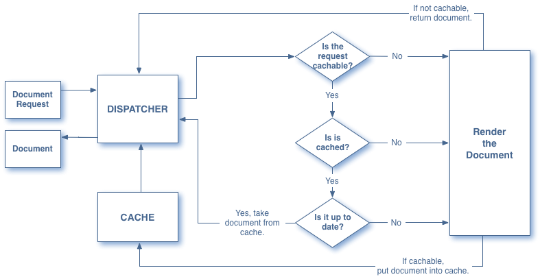
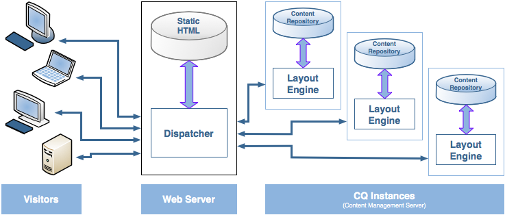

# Dispatcher 概述 {#dispatcher-overview}

>[!NOTE]
>
>Dispatcher 版本独立于 AEM。您可能是在单击以前版本的 AEM 文档中嵌入的 Dispatcher 文档链接后重定向到此页面。

Dispatcher是Adobe Experience Manager的缓存和负载平衡工具，可与企业级Web服务器一起使用。

部署Dispatcher的流程与所选的Web服务器和操作系统平台无关：

1. 了解 Dispatcher（此页面）。另请参阅 [有关Dispatcher的常见问题解答](https://experienceleague.adobe.com/docs/experience-manager-dispatcher/using/troubleshooting/dispatcher-faq.html?lang=en).
1. 按照 Web 服务器文档安装[支持的 Web 服务器](https://experienceleague.adobe.com/docs/experience-manager-65/deploying/introduction/technical-requirements.html?lang=zh-Hans)。
1. 在 Web 服务器上[安装 Dispatcher 模块](dispatcher-install.md)，并相应地配置 Web 服务器。
1. [配置 Dispatcher](dispatcher-configuration.md)（dispatcher.any 文件）。
1. [配置 AEM](page-invalidate.md)，以便内容更新后，使缓存失效。

>[!NOTE]
>
>要更好地了解如何将 Dispatcher 与 AEM 配合使用，请执行以下操作：
>
>* 参阅 [2017 年 7 月版 AEM 社区专家疑难解答](https://communities.adobeconnect.com/pf0gem7igw1f/)。
>* 访问[此存储库](https://github.com/adobe/aem-dispatcher-experiments)。它包含一系列“家用版”实验室格式的实验。


根据需要使用以下信息：

* [Dispatcher 安全核对清单](security-checklist.md)
* [Dispatcher 知识库](https://helpx.adobe.com/experience-manager/kb/index/dispatcher.html)
* [优化网站缓存性能](https://experienceleague.adobe.com/docs/experience-manager-64/deploying/configuring/configuring-performance.html?lang=en)
* [在多个域中使用 Dispatcher](dispatcher-domains.md)
* [将 SSL 与 Dispatcher 结合使用](dispatcher-ssl.md)
* [实施权限敏感型缓存](permissions-cache.md)
* [Dispatcher 问题疑难解答](dispatcher-troubleshooting.md)
* [Dispatcher 常见问题解答](dispatcher-faq.md)

>[!NOTE]
>
>**Dispatcher 最常见的用法**&#x200B;是缓存来自 AEM **发布实例**&#x200B;的响应，从而提高面向外部发布的网站的响应速度和安全性。大部分讨论主要介绍这种情况。
>
>但是，Dispatcher 也可以用于提高&#x200B;**创作实例**&#x200B;的响应速度，尤其是在有大量用户编辑和更新网站的情况下。有关这种情况的详细信息，请参阅下面的[将 Dispatcher 与作者服务器一起使用](#using-a-dispatcher-with-an-author-server)。

## 为何使用 Dispatcher 来实施缓存？ {#why-use-dispatcher-to-implement-caching}

发布 Web 有两种基本方法：

* **静态Web服务器**:例如Apache或IIS，简单但速度很快。
* **内容管理服务器**：提供动态、实时、智能的内容，但需要更多的计算时间和其他资源。

Dispatcher 可帮助实现既快速又动态的环境。它在静态 HTML 服务器（比如 Apache）中使用的目的是：

* 以静态网站的形式尽可能多地存储（“缓存”）站点内容
* 尽可能少地访问布局引擎。

这意味着：

* **静态内容** 处理速度和容易度与在静态Web服务器上相同。 此外，您还可以使用可用于静态Web服务器的管理和安全工具。

* 根据需要生成&#x200B;**动态内容**，完全没有必要再减慢系统速度。

Dispatcher 包含根据动态站点内容生成和更新静态 HTML 的机制。您可以详细指定将哪些文档存储为静态文件，哪些文档始终通过动态方式生成。

本节说明了此过程背后的原则。

### 静态 Web 服务器 {#static-web-server}


静态 Web 服务器（如 Apache 或 IIS），负责向网站的访客提供静态 HTML 文件。静态页面只创建一次，因此每个请求都会交付相同的内容。

该过程简单、高效。 如果访客请求HTML页面等文件，则会直接从内存中获取该文件；最坏的情况是，从本地驱动器读取。 静态Web服务器已有相当长的一段时间可用，因此有多种用于管理和安全管理的工具，并且它们与网络基础结构很好地集成。

### 内容管理服务器 {#content-management-servers}



如果您使用CMS（内容管理服务器）(如AEM)，则高级布局引擎会处理访客的请求。 引擎从存储库中读取内容，该存储库与样式、格式和访问权限相结合，将内容转换为根据访客需求和权限量身定制的文档。

通过此工作流，您可以创建更丰富的动态内容，从而提高网站的灵活性和功能。 但是，布局引擎需要比静态服务器更大的处理能力，因此，如果许多访客同时使用系统，则此设置的速度可能会减慢。

## Dispatcher 如何执行缓存 {#how-dispatcher-performs-caching}



**缓存目录**：对于执行缓存，Dispatcher 模块利用 Web 服务器的功能来提供静态内容。Dispatcher 将缓存文档放在 Web 服务器的文档根目录下。

>[!NOTE]
>
>如果没有配置 HTTP 标头缓存，则 Dispatcher 仅存储页面的 HTML 代码 - 它不会存储 HTTP 标头。如果您在网站中使用不同的编码，则可能会出现此情况，因为这些页面可能会丢失。 要启用 HTTP 标头缓存，请参阅[配置 Dispatcher 缓存。](https://experienceleague.adobe.com/docs/experience-manager-dispatcher/using/configuring/dispatcher-configuration.html?lang=zh-Hans)

>[!NOTE]
>
>将 Web 服务器的文档根目录放置在网络连接存储 (NAS) 上，会导致性能下降。此外，当NAS上的文档根目录在多个Web服务器之间共享时，执行复制操作时可能会出现间歇性锁定。

>[!NOTE]
>
>Dispatcher 使用与请求的 URL 相同的结构存储缓存文档。
>
>文件名长度可能存在操作系统级别的限制。 即，如果您的URL具有大量选择器。

### 缓存方法

Dispatcher 有两种主要方法可用于在对网站进行更改后更新缓存内容。

* **内容更新** 删除已更改的页面以及与其直接关联的文件。
* **自动失效**&#x200B;可在更新后自动使可能已过期的这部分缓存失效。也就是说，它可以有效地将相关页面标记为已过期，而不会删除任何内容。

### 内容更新

在内容更新中，有一个或多个 AEM 文档发生了变更。AEM 向 Dispatcher 发送联合请求，以相应地更新缓存：

1. 它会从缓存中删除修改的文件。
1. 它从缓存中删除以相同句柄开头的所有文件。例如，如果更新了 /en/index.html 文件，则以 /en/index. 开头的所有文件都会被删除。利用此机制，可设计高效缓存的站点，特别是有关图片导航的站点。
1. 它 *触碰* 所谓的 **statfile**，用于更新statfile的时间戳，以指示上次更改的日期。

应注意以下几点：

* 内容更新通常与创作系统一起使用，后者“知道”必须替换的内容。
* 会删除受内容更新影响的文件，但不会立即替换。下次再请求此类文件时，Dispatcher将从AEM实例获取新文件，并将其放置到缓存中，覆盖旧内容。
* 通常情况下，自动生成的图片（包含来自页面的文本）将存储在以相同句柄开头的图片文件中 - 从而确保存在关联以便于删除。例如，您可以将 mypage.html 页面的标题文本作为 mypage.titlePicture.gif 图片存储在相同的文件夹中。这样每次更新页面后就会自动从缓存中删除图片，您就可以确保图片始终反映页面的最新版本。
* 您可能有多个 statfile，例如每个语言文件夹一个。如果页面已更新，AEM 将查找包含 statfile 的下一个父文件夹，然后处理&#x200B;**&#x200B;该文件。

### 自动失效

自动失效可自动使部分缓存失效 - 不会实际删除任何文件。在每次内容更新时，都会处理所谓的 statfile，因此其时间戳记可以反映最新的内容更新日期。

Dispatcher 有一个遵循自动失效机制的文件列表。当请求该列表中的文档时，Dispatcher 会将缓存文档的日期与 statfile 的时间戳记进行比较：

* 如果缓存文档的日期较新，则 Dispatcher 将返回缓存文档。
* 如果日期较旧，则 Dispatcher 将从 AEM 实例中检索最新版本。

同样，应当注意这几点：

* 当内部关系(如HTML页面)复杂时，通常使用自动失效。 这些页面包含链接和导航条目，因此通常在内容更新后必须进行更新。如果您有自动生成的PDF或图片文件，则也可以选择使这些文件自动失效。
* 除了处理statfile之外，自动失效不涉及Dispatcher在更新时执行任何操作。 但是，处理 statfile 会自动使缓存内容过时，从而不会将其从缓存中实际删除。

## Dispatcher 如何返回文档 {#how-dispatcher-returns-documents}



### 确定文档是否实施了缓存

您可以[在配置文件中定义 Dispatcher 缓存的文档](https://experienceleague.adobe.com/docs/experience-manager-dispatcher/using/configuring/dispatcher-configuration.html?lang=zh-Hans)。Dispatcher 根据可缓存文档列表检查请求。如果文档不在此列表中，则 Dispatcher 从 AEM 实例中请求该文档。

在以下情况下，Dispatcher 始终直接从 AEM 实例请求文档：

* 请求URI包含问号“`?`&quot; 此方案通常表示无需缓存的动态页面，如搜索结果。
* 缺失文件扩展名。Web 服务器需要扩展名来确定文档类型（比如 MIME 类型）。
* 身份验证标头已设置（可配置）。

>[!NOTE]
>
>GET 或 HEAD（针对 HTTP 标头）方法可由 Dispatcher 缓存。有关响应标头缓存的其他信息，请参阅[缓存 HTTP 响应标头](https://experienceleague.adobe.com/docs/experience-manager-dispatcher/using/configuring/dispatcher-configuration.html?lang=zh-Hans)部分。

### 确定文档是否已缓存

Dispatcher 将缓存文件存储在 Web 服务器上，当做静态网站的一部分。如果用户请求可缓存的文档，则Dispatcher检查该文档是否存在于Web服务器的文件系统中：

* 如果文档已缓存，则 Dispatcher 返回该文件。
* 如果未缓存，则 Dispatcher 从 AEM 实例请求该文档。

### 确定文档是否为最新状态

为确定文档是否为最新状态，Dispatcher 将执行两个步骤：

1. 它检查文档是否遵循自动失效机制。如果不遵循，则该文档是最新状态。
1. 如果该文档配置为自动失效，则 Dispatcher 检查它比最后一次可用更改旧还是新。如果较旧，则 Dispatcher 从 AEM 实例请求当前版本，并替换缓存中的版本。

>[!NOTE]
>
>文档（无） **自动失效** 一直保留在缓存中，直到被实际删除。 例如，通过网站上的内容更新。

## 负载平衡的好处 {#the-benefits-of-load-balancing}

负载平衡就是在多个 AEM 实例间分发网站的计算负载。



您将获得：

* **增强的处理能力**
实际上，更大的处理能力意味着Dispatcher在多个AEM实例之间共享文档请求。 由于现在每个实例处理的文档数量减少，您的响应速度将会加快。Dispatcher 保留每个文档类别的内部统计信息，以便能够估计负载并高效分发查询。

* **增加的故障保护范围**
如果Dispatcher未收到来自实例的响应，它会自动将请求中继到另一个实例。 如果实例变得不可用，则唯一的效果是网站速度减慢，这与计算能力损失成正比。 但是，所有服务都会继续。

* 您还可以在同一静态Web服务器上管理不同的网站。

>[!NOTE]
>
>负载平衡可以有效分布负载，而缓存有助于减少负载。因此，在设置负载平衡之前，请尝试优化缓存并降低整体负载。良好的缓存机制可能会提高负载平衡器的性能，或者弃用不必要的负载平衡。

>[!CAUTION]
>
>虽然单个Dispatcher能够使可用Publish实例的容量饱和，但对于某些极少数的应用程序而言，也可以平衡两个Dispatcher实例之间的负载。 配置多个Dispatcher时必须仔细考虑，因为额外的Dispatcher可增加可用Publish实例的负载，并且可以轻松降低大多数应用程序的性能。

## Dispatcher 如何执行负载平衡 {#how-the-dispatcher-performs-load-balancing}

### 性能统计数据

Dispatcher 保留有关 AEM 每个实例处理文档的速度的内部统计信息。Dispatcher会根据这些数据估算哪个实例在响应请求时可提供最快的响应时间，因此它会在该实例上保留必要的计算时间。

不同类型的请求的平均完成时间可能各不相同，因此Dispatcher允许您指定文档类别。 然后在计算时间估计时考虑这些类别。 例如，您可以区分HTML页面和图像，因为典型响应时间可能相差很大。

如果您使用复杂的搜索功能，则可以为搜索查询创建一个类别。 此方法可帮助Dispatcher将搜索查询发送到响应最快的实例。 它还有助于防止速度较慢的实例在收到多个“昂贵”的搜索查询时出现停滞，而其他实例收到“较便宜”的请求。

### 个性化的内容（粘性连接）

粘性连接可确保同一个用户的文档全部在 AEM 的同一个实例上撰写。如果您使用个性化的页面和会话数据，这一点很重要。 数据存储在该实例上，则同一用户发出的后续请求必须返回到该实例，否则数据就会丢失。

由于粘性连接会限制 Dispatcher 优化请求的能力，因此应仅在需要时使用。您可以指定包含“粘性”文档的文件夹，从而确保该文件夹中每个用户的所有文档都在同一个实例上撰写。

>[!NOTE]
>
>对于使用粘性连接的大多数页面，必须关掉缓存 - 否则无论会话内容是什么，所有用户都将看到相同的页面内容。
>
>对于&#x200B;*少数*&#x200B;应用程序，可以同时使用粘性连接和缓存；例如，显示将数据写入会话的表单。

## 使用多个 Dispatcher {#using-multiple-dispatchers}

在复杂设置中，您可以使用多个 Dispatcher。例如，您可以使用：

* 一个 Dispatcher 用于在内联网上发布网站
* 第二个 Dispatcher，通过不同的地址和不同的安全设置，在内联网上发布相同的内容。

在这种情况下，请确保每个请求只通过一个 Dispatcher。一个 Dispatcher 不能处理来自另一个 Dispatcher 的请求。因此，请确保两个 Dispatcher 都能直接访问 AEM 网站。

## 将 Dispatcher 与 CDN 结合使用 {#using-dispatcher-with-a-cdn}

内容交付网络 (CDN)（如 Akamai Edge Delivery 或 Amazon Cloud Front）从距离最终用户较近的站点交付内容。这样，它可以

* 加快最终用户响应速度
* 减少服务器的负载

作为HTTP基础架构组件，CDN的工作方式与Dispatcher非常相似。当CDN节点收到请求时，如果可能，它会从其缓存中提供请求（该资源在缓存中可用，并且有效）。 否则，它将连接下一个距离最近的服务器，以检索资源并缓存下来，以备响应后续请求（如果适用）。

“下一个距离最近的服务器”取决于您的具体设置。例如，在 Akamai 设置中，请求可以遵循以下路径：

* Akamai 边缘节点
* Akamai Midgres 图层
* 您的防火墙
* 您的负载平衡器
* Dispatcher
* AEM

通常， Dispatcher是下一台服务器，它可能从缓存中提供文档，并影响返回到CDN服务器的响应标头。

## 控制 CDN 缓存 {#controlling-a-cdn-cache}

CDN可通过多种方法控制在从Dispatcher重新获取资源之前，该CDN缓存资源的时长。

1. 显式配置\
   根据mime类型、扩展名、请求类型等，配置特定资源在CDN缓存中的保留时间。

1. 到期和缓存控制标头\
   CDN的荣誉 `Expires:` 和 `Cache-Control:` HTTP标头（如果由上游服务器发送）。 例如，通过使用 [mod_expires](https://httpd.apache.org/docs/2.4/mod/mod_expires.html) Apache模块。

1. 手动失效\
   CDN 允许通过 Web 界面从缓存中删除资源。
1. 基于API的失效\
   大多数 CDN 还提供允许从缓存中删除资源的 REST 和/或 SOAP API。

在典型的AEM设置中，按扩展、按路径或同时按两者进行配置（可通过以上第1点和第2点实现），为经常使用但不经常更改的资源（如设计图像和客户端库）设置合理的缓存期限。 在部署新版本时，通常需要手动进行失效操作。

如果将此方法用于缓存受管内容，则意味着仅在配置的缓存期限到期且再次从 Dispatcher 中获取文档后，内容变更才对最终用户可见。

为了实现更细粒度的控制，基于API的失效允许您在Dispatcher缓存失效时使CDN的缓存失效。 基于CDN API，您可以实施自己的 [ContentBuilder](https://developer.adobe.com/experience-manager/reference-materials/6-5/javadoc/com/day/cq/replication/ContentBuilder.html) 和 [传输处理程序](https://developer.adobe.com/experience-manager/reference-materials/6-5/javadoc/com/day/cq/replication/TransportHandler.html) （如果API不基于REST），请设置复制代理，以使用这些段来使CDN的缓存失效。

>[!NOTE]
>
>另请参阅 [AEM (CQ) Dispatcher 安全性和 CDN+浏览器缓存](https://www.slideshare.net/andrewmkhoury/dispatcher-caching-aemgemspart2jan2015)和有关 [Dispatcher 缓存](https://experienceleague.adobe.com/docs/experience-manager-gems-events/gems/gems2015/aem-dispatcher-caching-new-features-and-optimizations.html?lang=en)的录制演讲。

## 将 Dispatcher 与创作服务器一起使用 {#using-a-dispatcher-with-an-author-server}

>[!CAUTION]
>
>如果您使用 [AEM与触屏UI](https://experienceleague.adobe.com/docs/experience-manager-65/developing/introduction/touch-ui-concepts.html?lang=en), do **not** 缓存创作实例内容。 如果为创作实例启用了缓存，则必须禁用缓存并删除缓存目录的内容。 要禁用缓存，请编辑 `author_dispatcher.any` 文件，并修改 `/rule` 属性 `/cache` 部分如下：

```xml
/rules
{
/0000
{ /type "deny" /glob "*"}
}
```

Dispatcher 可在创作实例之前使用以提高创作性能。要配置创作 Dispatcher，请执行以下操作：

1. 在Web服务器(Apache或IIS Web服务器，请参阅 [安装Dispatcher](dispatcher-install.md))。
1. 针对正在工作的AEM发布实例测试新安装的Dispatcher。 这样做可确保实现基线正确的安装。
1. 现在，确保 Dispatcher 能够通过 TCP/IP 连接到您的创作实例。
1. 替换示例 `dispatcher.any` 文件 `author_dispatcher.any` 文件 [Dispatcher下载](release-notes.md#downloads).
1. 在文本编辑器中打开 `author_dispatcher.any`，并进行以下更改：

   1. 更改 `/hostname` 和 `/port` 的 `/renders` 部分，以便它们指向您的创作实例。
   1. 更改 `/docroot` 的 `/cache` 部分，以便它们指向缓存目录。 如果您将 [AEM 与 Touch UI](https://experienceleague.adobe.com/docs/experience-manager-65/developing/introduction/touch-ui-concepts.html?lang=en) 一起使用，请查看上面的警告。
   1. 保存更改。

1. 删除您在前面配置的 `/cache` > `/docroot` 目录中的所有现有文件。
1. 重新启动 Web 服务器。

>[!NOTE]
>
>提供 `author_dispatcher.any` 配置时，安装会影响下任何内容的CQ5功能包、修补程序或应用程序代码包 `/libs` 或 `/apps`，则必须删除Dispatcher缓存中这些目录下的缓存文件。 这样做可确保下次再请求时，会获取新升级的文件，而不是旧的缓存文件。

>[!CAUTION]
>
>如果您使用之前配置的创作Dispatcher并启用了 *调度程序刷新代理*，请执行以下操作：

1. 删除或禁用 **作者Dispatcher的** 正在刷新AEM创作实例上的代理。
1. 按照上面的新说明，重做创作Dispatcher配置。

<!--
[Author Dispatcher configuration file (Dispatcher 4.1.2 or later)](assets/author_dispatchernew.any)
-->
<!--[!NOTE]
>
>A related knowledge base article can be found here:  
>[How to configure the dispatcher in front of an authoring environment](https://helpx.adobe.com/cq/kb/HowToConfigureDispatcherForAuthoringEnvironment.html)
-->
